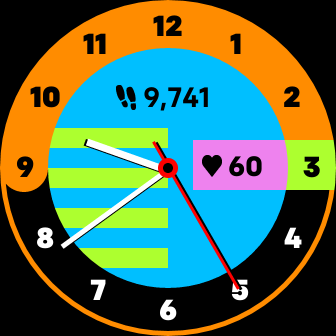

# 80s Watch

80s Watch is a clock face featuring a design inspired by graphics of the 1980s. The clock face includes multiple color set options that change when the watch screen is clicked. Additionally the current daily step count and heart rate are displayed. The step count and heart rate can be optionally turned off by turning off the activity and heart rate permissions. 

